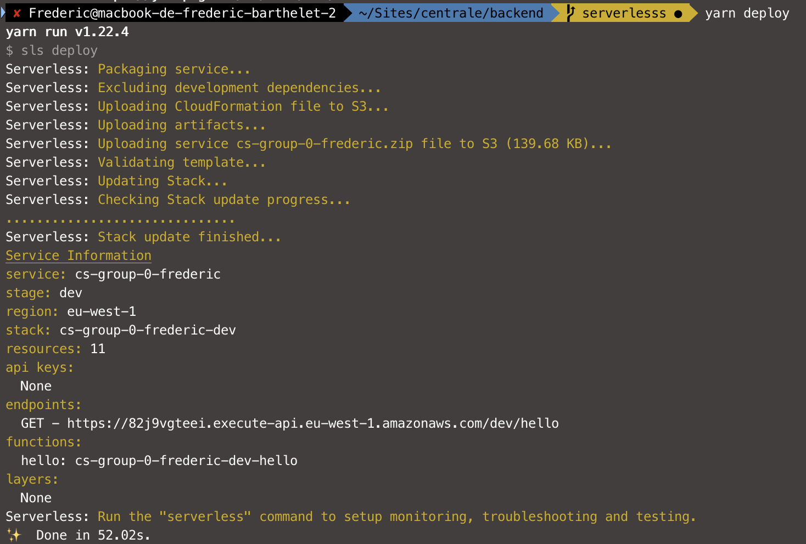
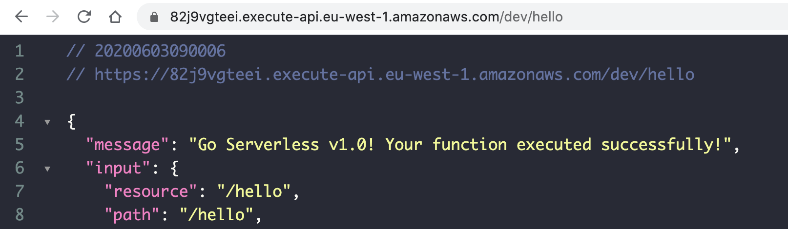
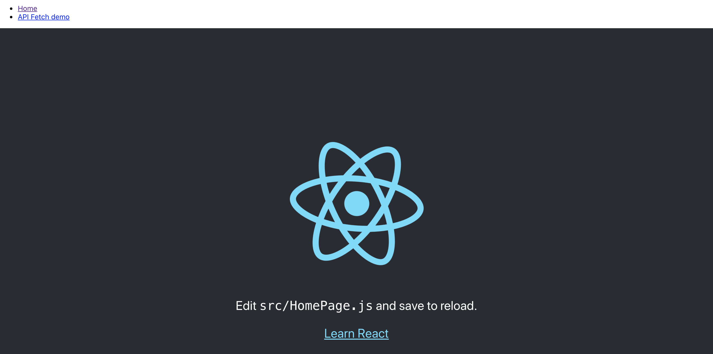

# STWeb

## Installation du projet

### Prérequis

- [github](https://github.com) - **check :** je peux m'authentifier sur Github (je vois ma photo de profil et mon nom dans le header en haut à droite)
- [git](https://git-scm.com/book/en/v2/Getting-Started-Installing-Git) - **check :** `git --version` retourne un numéro de version
- [node 12](https://nodejs.org/en/download/) - **check :** `node --version` retourne une version au moins supérieure à la `v12.0.0`
- [yarn](https://yarnpkg.com/getting-started/install) - **check :** `yarn --version` retourne une version au moins supérieurs à `v1.0.0`
- [aws cli](https://docs.aws.amazon.com/cli/latest/userguide/install-cliv2.html) - **check :** `aws --version` retourne une version au moins supérieure à la `aws-cli/2.0.0`, la version de Python précisée importe peu
- configurer les identifiants de connexion au compte AWS du cours :

    - Taper la commande `aws configure` et renseigner les informations suivantes pour chaque entrée demandée :

        - AWS Access Key ID : **voir sur Slack**
        - AWS Secret Access Key : **voir sur Slack**
        - Default region name : `eu-west-1`
        - Default output format : `json`

### Premier setup

- Forker le repository https://github.com/AleBlondin/centrale - **1 SEULE FOIS PAR GROUPE**
- Cloner le repository forké sur votre machine locale, dans le dossier de votre choix (`git clone <url du repo forké>`)
- Copier le fichier `backend/stage.dev.dist.yml` vers `backend/stage.dev.yml` et y remplir son numéro de groupe et son prénom, comme indiqué dans le fichier
- Se rendre dans le terminal à la racine du dossier `backend` de ce projet et jouer la commande `yarn` puis `yarn deploy`
- Une fois le process de déploiement complété (quelques minutes pour le premier déploiement), copier l'URL retourné et tester dans un navigateur que l'URL répond comme attendu

    
    *Résultat de la commande de déploiement*

    
    *Appel HTTP à l'URL généré*

- Bravo ! Le backend fonctionne !
- Se rendre dans le terminal à la racine du dossier `client` de ce projet et jouer la commande `yarn` puis `yarn start` (ca devrait normalement ouvrir un nouvel onglet dans votre navigateur à l'URL http://localhost:3000).

    
    *Client web démarré*

- Bravo ! Le client fonctionne !

### Resources pour la suite du cours

- [Liste des commandes disponibles](doc/available_commands.md)
- [Attendus du cours](doc/expectations.md)
- [Liens utiles / Pense-bête](doc/useful_links.md)
